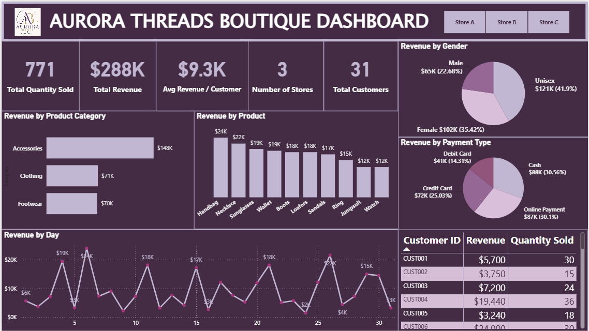

# Aurora Threads Fashion Retail Sales Analysis

**Power BI | Fashion Retail Analytics | Sales Performance | Customer Behaviour | Business Intelligence**

## Overview

Aurora Threads is a fashion boutique operating across three stores and offering clothing, footwear, and accessories. This project uses Power BI to analyse transaction-level sales data and provide a clear management view of revenue performance, product demand, customer behaviour, payment preferences, and store activity.

I developed an interactive executive dashboard that turns the underlying sales data into business-focused KPIs and visual insights, helping decision-makers identify the products, customer groups, and commercial patterns contributing most strongly to revenue.

---

## Key Results at a Glance

| KPI | Result |
|---|---:|
| Total Revenue | **$288.46K** |
| Total Quantity Sold | **771** |
| Total Customers | **31** |
| Number of Stores | **3** |
| Average Revenue per Customer | **$9.3K** |
| Highest-Revenue Category | **Accessories — $147.74K** |
| Highest-Revenue Product | **Handbag — $24K** |
| Highest-Revenue Store | **Store B — $104.96K** |

---

# Dashboard



The dashboard provides a consolidated view of sales performance across products, customers, stores, gender segments, payment methods, and time.

### What the dashboard monitors

- Total quantity sold
- Total revenue
- Average revenue per customer
- Number of stores
- Total customers
- Revenue by product category
- Top products by revenue
- Revenue by gender
- Revenue by payment type
- Daily revenue trend
- Customer-level revenue and quantity purchased
- Store-level filtering

---

# Business Problem

Aurora Threads needed a clearer way to interpret its growing sales data and monitor performance across products and customer activity.

The analysis was designed to answer key commercial questions:

1. Which product categories generate the most revenue?
2. Which individual products contribute most strongly to sales?
3. How does revenue fluctuate over time?
4. How is revenue distributed across gender segments?
5. Which payment methods contribute the most revenue?
6. Which customers generate the highest revenue and purchase volumes?
7. How does performance differ across the three stores?

---

# Analytical Approach

The project followed a practical business intelligence workflow:

**Sales Data → Data Preparation → KPI Development → Power BI Dashboard → Business Insights → Recommendations**

Revenue was analysed after accounting for transaction quantity and discount:

`Revenue = Quantity × Sales Amount × (1 − Discount)`

The dashboard was then structured around executive KPIs and supporting breakdowns for product, customer, payment, store, and time-based analysis.

---

# Key Business Insights

### 1. Accessories are the strongest revenue category

Accessories generated approximately **$147.74K**, representing just over half of total revenue and substantially outperforming Clothing (**$70.82K**) and Footwear (**$69.90K**).

This indicates that Accessories are a major commercial driver for Aurora Threads.

### 2. Handbags lead individual product performance

Handbags generated approximately **$24K**, making them the highest-revenue individual product.

Necklaces followed at approximately **$21.6K**, with Sunglasses contributing approximately **$19.44K**.

### 3. Unisex products generate the largest gender-segment revenue

Unisex products contributed approximately **$120.86K (41.9%)** of revenue.

Female-targeted products generated approximately **$102.17K (35.4%)**, while Male-targeted products generated approximately **$65.43K (22.7%)**.

The result suggests that products with broader customer appeal form an important part of Aurora Threads' revenue base.

### 4. Cash and online payments are the leading payment channels

Cash generated approximately **$88.16K**, narrowly ahead of Online Payment at approximately **$86.82K**.

Credit Card contributed approximately **$72.19K**, while Debit Card generated approximately **$41.29K**.

Cash and digital purchasing therefore both play important roles in the customer payment mix.

### 5. Store performance is uneven

**Store B generated approximately $104.96K**, making it the highest-revenue location.

Store C followed at approximately **$100.23K**, while Store A generated approximately **$83.27K**.

The difference provides an opportunity to investigate product mix, customer demand, promotions, and local purchasing behaviour across stores.

### 6. Revenue varies considerably throughout the month

Daily revenue shows several pronounced peaks and troughs rather than a stable pattern.

Understanding whether these fluctuations relate to promotions, customer purchasing cycles, store activity, or product availability could support better stock and campaign planning.

### 7. Revenue per customer is commercially significant

Across **31 unique customers**, average revenue per customer was approximately **$9.3K**.

Customer-level analysis can therefore help Aurora identify high-value customers and understand where retention or personalised engagement could have the greatest commercial impact.

---

# Business Recommendations

**Prioritise high-performing accessory lines**  
Protect availability of strong accessory products while investigating which product attributes and customer segments are driving their performance.

**Use product-level revenue to guide assortment decisions**  
Maintain visibility of top-performing products such as Handbags and Necklaces while reviewing lower-performing products for pricing, promotion, or assortment opportunities.

**Investigate Store A's performance gap**  
Compare Store A with Stores B and C across product mix, customer activity, discounts, and purchasing patterns to identify potential improvement opportunities.

**Support both physical and digital payment preferences**  
Cash and Online Payment contribute similar levels of revenue, so Aurora should maintain a convenient experience across both payment behaviours.

**Develop customer-value reporting**  
Use customer-level revenue and purchase quantities to identify high-value customers and support targeted retention or personalised offers.

**Monitor daily sales patterns alongside promotions**  
Overlay future promotional activity, campaigns, and stock availability with daily revenue to understand the causes of sales peaks and weaker periods.

---

# Power BI Development

### Capabilities demonstrated

- Data preparation
- DAX measures
- KPI development
- Interactive dashboard design
- Store filtering
- Product and category analysis
- Customer-level analysis
- Payment-method analysis
- Time-series analysis
- Customer segmentation
- Business-focused data visualisation
- Insight generation
- Management reporting

### Key measures

Examples of analytical measures used in the report include:

```DAX
Total Revenue =
SUM('Aurora Threads'[Revenue])

Total Customers =
DISTINCTCOUNT('Aurora Threads'[Customer ID])

Total Quantity Sold =
SUM('Aurora Threads'[Quantity])

Avg Revenue per Customer =
DIVIDE(
    SUM('Aurora Threads'[Revenue]),
    DISTINCTCOUNT('Aurora Threads'[Customer ID])
)
```

---

# Dataset

The dataset contains **93 transaction records** and covers sales across three Aurora Threads stores.

Key fields include:

- Date
- Store
- Product
- Category
- Gender
- Quantity
- Sales Amount
- Customer ID
- Discount
- Payment Type

A derived **Revenue** calculation was used for the analysis.

For field-level definitions, see the **[Data Dictionary](documentation/data_dictionary.md)**.

---

# Tools & Skills

### Tools
- **Microsoft Power BI** — dashboard development, measures, filtering, and visual analysis
- **Microsoft Excel** — source data

### Skills demonstrated
- Sales analysis
- Retail analytics
- Product performance analysis
- Customer behaviour analysis
- Store performance analysis
- Payment-method analysis
- Trend analysis
- KPI reporting
- DAX
- Data visualisation
- Business intelligence
- Data storytelling
- Insight generation
- Business recommendations

---

# Repository Structure

```text
aurora-threads-fashion-retail-sales-analysis/
│
├── README.md
│
├── data/
│   └── Aurora_Threads_Data.xlsx
│
├── images/
│   └── aurora_threads_dashboard.png
│
└── documentation/
    └── data_dictionary.md
```

---

# Project Context

Aurora Threads is a portfolio case-study business. This project demonstrates how Power BI can transform retail transaction data into an executive reporting solution focused on sales, products, customers, stores, payment behaviour, and revenue trends.

---

## Author

**Ifeoma Edeh**

**Data Analyst | Power BI | Excel | SQL | Data Visualisation**
